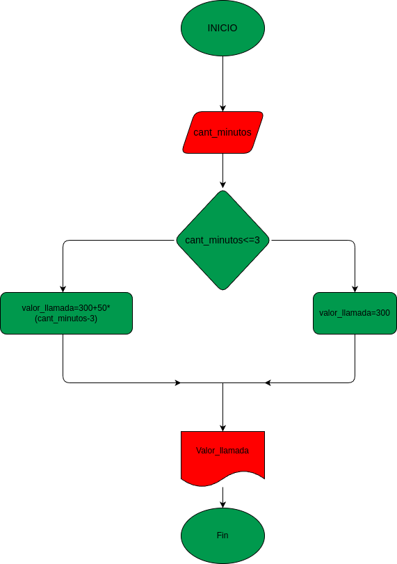

# Condicionales_1
Condicionales #1

## Costo de una llamada telefónica

Ingresar el tiempo de duración de una llamada telefónica y determinar la cantidad a pagar,de acuerdo con lo siguiente:

- Toda llamada que dure 3 minutos o menos tiene un costo de 300 pesos.

- cada minuto adicional cuesta 50 pesos

# Análisis

## Input

### Variables de entrada

cant_minutos: la cantidad de minutos que duró la llamada

## Processing

valor_llamada=300+50*(cant_minutos-3)

## Output

valor_llamada

# Diseño

 "diagrama de flujo"

# construcción

